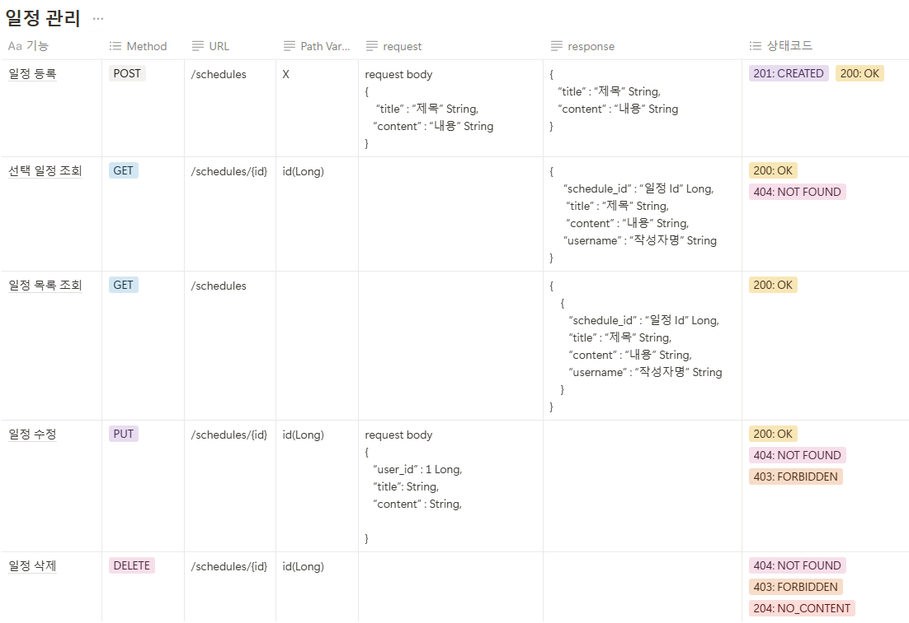
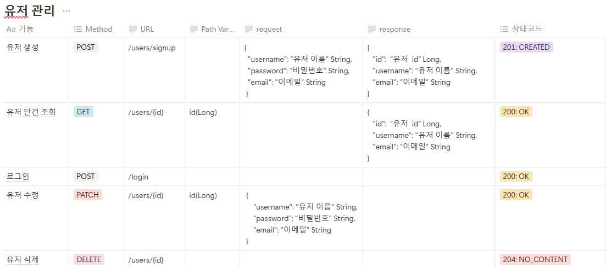
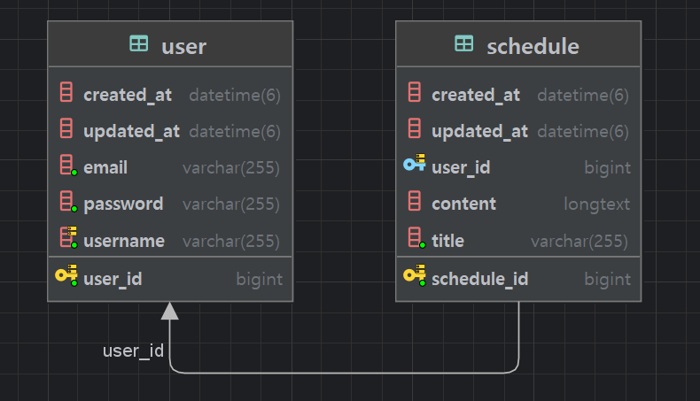

# ️ 📆 프로젝트 소개

###  ✅ 일정 관리 CRUD, 유저 관리 CRUD 
<br>

## 📆 API 명세 및 ERD 작성  ##
* API 명세서 작성하기.
* ERD 작성하기.
* SQL 작성하기.

<br>

**1. 일정 관리 API 명세서**



<br><br>

**2. ERD 작성**



<br><br>

  ```
CREATE TABLE schedule
(
    schedule_id     BIGINT AUTO_INCREMENT PRIMARY KEY COMMENT '일정 식별자',
    user_id         BIGINT	NOT NULL COMMENT '유저 식별자',
    title	        VARCHAR(50)	NOT NULL COMMENT '제목',
    content	        VARCHAR(2000)	NOT NULL COMMENT '내용',
    createdAt	    DATETIME DEFAULT CURRENT_TIMESTAMP	NOT NULL COMMENT '작성일',
    modifiedAt	    DATETIME DEFAULT CURRENT_TIMESTAMP	NOT NULL COMMENT '수정일',
    CONSTRAINT  schedule_fk1 FOREIGN KEY (user_id) REFERENCES  user (user_id)
);
```
```
CREATE TABLE user
(
    user_id         BIGINT AUTO_INCREMENT PRIMARY KEY COMMENT '유저 식별자',
    username	    VARCHAR(25)	NOT NULL COMMENT '유저명',
    password	    VARCHAR(10)	NOT NULL COMMENT '비밀번호',
    email	        VARCHAR(50)	NOT NULL COMMENT '이메일',
    createdAt	    DATETIME DEFAULT CURRENT_TIMESTAMP	NOT NULL COMMENT '작성일',
    modifiedAt	    DATETIME DEFAULT CURRENT_TIMESTAMP	NOT NULL COMMENT '수정일'
);
```
## 🛠️ 기술 스택 (Tech Stack)

| 상세 분야              | 기술             |
|------------------------|------------------|
| 언어            | Java             |
| 프레임워크      | Spring Boot      |
| ORM       | JPA / Hibernate  |
| 데이터베이스           | MySQL            |
| 코드 간소화 도구       | Lombok           |
| API 설계 방식          | REST API         |
| API 테스트 도구        | Postman          |
| HTTP 통신 방식         | HTTP Methods     |
| 빌드 및 의존성 관리    | Gradle   |
| 형상 관리 및 협업 도구 | Git / GitHub     |
| 개발 환경 (IDE)        | IntelliJ         |


